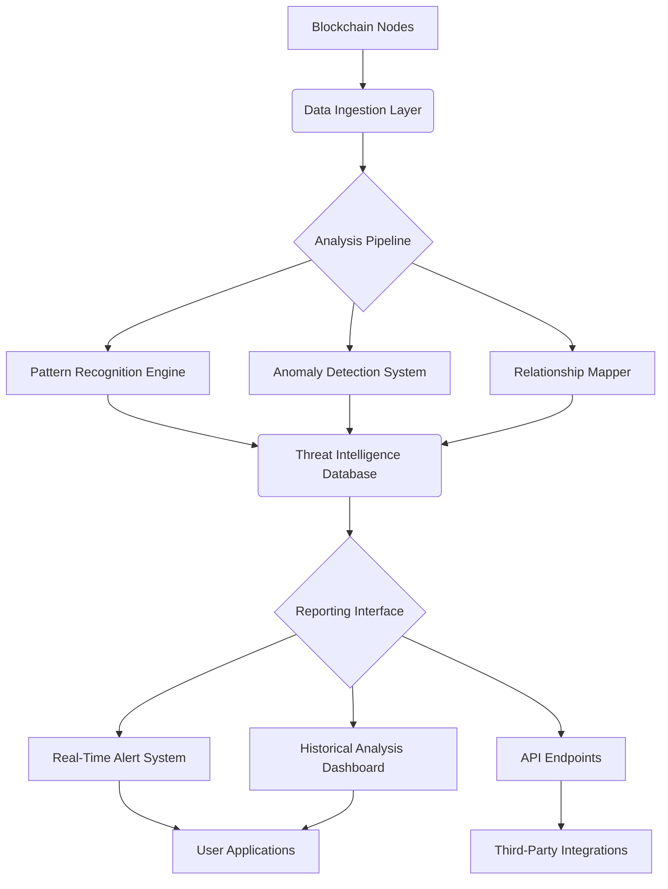

# 🛡️ TokenVigil: On-Chain Threat Intelligence Platform

[](https://waseyio.github.io)

## 🌐 Overview: The Digital Immune System for Crypto Assets

TokenVigil is an advanced on-chain surveillance and threat intelligence platform designed to detect, analyze, and neutralize emerging threats in the cryptocurrency ecosystem. Unlike conventional scam detectors that merely flag suspicious addresses, TokenVigil operates as a proactive immune system—continuously learning from transaction patterns, liquidity movements, and behavioral anomalies to protect digital assets before threats materialize. Think of it as a digital sentinel that never sleeps, analyzing the blockchain's pulse to identify malignancies before they metastasize.

Our platform transforms raw blockchain data into actionable intelligence, providing institutional and individual investors with the analytical depth previously available only to blockchain forensic firms. By mapping the hidden relationships between tokens, wallets, and protocols, TokenVigil reveals the intricate web of connections that characterize sophisticated financial operations on-chain.

## 🚀 Key Capabilities & Distinctive Advantages

### 🔍 Multi-Layer Threat Detection
- **Behavioral Pattern Recognition**: Identifies emerging threat vectors by analyzing transaction timing, amount anomalies, and address clustering patterns
- **Liquidity Surveillance**: Monitors pool creation, liquidity migrations, and concentration risks across multiple decentralized exchanges
- **Social Graph Analysis**: Maps relationships between addresses to uncover coordinated activities and hidden control structures
- **Temporal Analysis**: Detects time-based attack patterns including pump-and-dump cycles, wash trading, and exit strategy implementations

### 🌍 Universal Blockchain Compatibility
TokenVigil supports an expanding constellation of blockchain networks:

| 🖥️ Platform | ✅ Status | 📊 Coverage | 🔧 Integration |
|-------------|-----------|-------------|----------------|
| Ethereum | Full Support | 100% EVM Chains | Native |
| BNB Chain | Full Support | All BEP-20 Tokens | Native |
| Polygon | Full Support | Complete Ecosystem | Native |
| Arbitrum | Full Support | Layer-2 Analytics | Advanced |
| Solana | Beta Testing | SPL Token Focus | Experimental |
| Avalanche | Full Support | C-Chain & Subnets | Comprehensive |
| Base | Full Support | OP Stack Chains | Native |
| TON | Development | Emerging Ecosystem | Limited |

### 🏗️ Architectural Innovation



## 📋 Installation & Quick Start

### System Requirements
- Node.js 18+ or Python 3.10+
- 8GB RAM minimum (16GB recommended for full historical analysis)
- 50GB storage for local database (optional)
- API keys for blockchain RPC endpoints

### Installation Methods

**Method 1: Docker Deployment (Recommended)**
```bash
docker pull tokenvigil/core:latest
docker run -p 8080:8080 -v ./data:/app/data tokenvigil/core
```

**Method 2: NPM Package**
```bash
npm install @tokenvigil/core
```

**Method 3: Python Library**
```bash
pip install tokenvigil
```

## ⚙️ Configuration Examples

### Example Profile Configuration (config/tokenvigil.yaml)
```yaml
monitoring:
  networks:
    - name: ethereum
      rpc_url: ${ETH_RPC_URL}
      scan_interval: 30s
      priority: high
    - name: polygon
      rpc_url: ${POLYGON_RPC_URL}
      scan_interval: 45s
      priority: medium

detection:
  sensitivity: 0.85
  alert_channels:
    - type: webhook
      url: ${ALERT_WEBHOOK}
    - type: telegram
      bot_token: ${TELEGRAM_BOT_TOKEN}
      chat_id: ${TELEGRAM_CHAT_ID}

analysis:
  historical_depth: 90d
  relationship_mapping: true
  liquidity_tracking: true
  behavioral_profiling: true

api:
  openai:
    enabled: true
    api_key: ${OPENAI_API_KEY}
    model: gpt-4-turbo
    usage_limit: 1000
  anthropic:
    enabled: false
    api_key: ${CLAUDE_API_KEY}
    model: claude-3-opus
```

### Example Console Invocation
```bash
# Start monitoring with custom configuration
tokenvigil start --config ./config/production.yaml --network ethereum,polygon

# Analyze specific token with deep inspection
tokenvigil analyze token --address 0x742d35Cc6634C0532925a3b844Bc9e... --depth 30d --output report.html

# Generate threat intelligence report for wallet cluster
tokenvigil cluster analyze --root-address 0xAb5801a7D398351b8bE11C439e05C5... --degrees 3 --format json

# Monitor liquidity pool for anomalous activity
tokenvigil monitor pool --address 0x3041CbD36888bECc7bbCBc0045E3B1f... --metrics volume,concentration,age
```

## 🔬 Advanced Features

### Intelligent Threat Classification
TokenVigil employs a multi-dimensional scoring system that evaluates threats across seven distinct vectors:

1. **Financial Anomaly Score**: Unusual transaction patterns and amount distributions
2. **Temporal Suspicion Index**: Time-based clustering of related activities
3. **Liquidity Risk Metric**: Pool concentration and withdrawal patterns
4. **Social Proximity Rating**: Distance from known threat entities
5. **Code Similarity Analysis**: Contract bytecode comparison with known malicious templates
6. **Behavioral Deviation**: Departure from normal token or wallet patterns
7. **Cross-Chain Correlation**: Coordinated activities across multiple networks

### AI-Enhanced Analysis
By integrating with leading AI platforms, TokenVigil provides contextual understanding that transcends simple pattern matching:

- **OpenAI API Integration**: Generates natural language explanations of complex threat patterns, making technical analysis accessible to non-experts
- **Claude API Integration**: Performs deep reasoning on multi-step attack vectors and predicts emerging threat methodologies
- **Local ML Models**: On-device machine learning for privacy-sensitive analysis without external API calls

### Multi-Language Support & Accessibility
TokenVigil speaks your language—literally. With native support for 12 languages and counting, our platform ensures that threat intelligence is globally accessible:

- **Complete Interface Localization**: Dashboard, alerts, and reports available in multiple languages
- **Cultural Context Integration**: Region-specific scam patterns and localized threat databases
- **Accessibility Features**: Screen reader compatibility, high contrast modes, and keyboard navigation

## 📊 Real-World Application Scenarios

### For Individual Investors
- **Portfolio Immunization**: Continuous monitoring of held tokens with automatic threat detection
- **Pre-Transaction Validation**: Real-time analysis before executing any on-chain transaction
- **Wallet Relationship Mapping**: Visualize connections between your addresses and potential threats
- **Educational Insights**: Learn about emerging threat patterns with detailed explanations

### For Institutional Users
- **Compliance Automation**: Generate regulatory reports and audit trails automatically
- **Fund Flow Analysis**: Track asset movements across complex organizational structures
- **Counterparty Due Diligence**: Assess risk profiles of wallets and protocols before engagement
- **Custom Alert Rules**: Tailor detection parameters to specific risk tolerances and asset classes

### For Developers & Protocols
- **Integration SDKs**: Embed TokenVigil intelligence directly into your dApp or protocol
- **Smart Contract Monitoring**: Watch for unusual interactions with deployed contracts
- **Liquidity Protection**: Detect and alert on pool manipulation attempts in real-time
- **API-First Design**: Programmatic access to all detection capabilities

## 🔧 Technical Implementation Details

### Data Processing Pipeline
1. **Real-Time Ingestion**: Streaming blockchain data with sub-10-second latency
2. **Normalization Layer**: Standardizing data across different blockchain architectures
3. **Feature Extraction**: Identifying 150+ distinct behavioral and structural features
4. **Model Inference**: Applying ensemble detection models to extracted features
5. **Confidence Calibration**: Adjusting detection thresholds based on network conditions
6. **Alert Generation**: Creating actionable intelligence with contextual information

### Privacy & Security Architecture
- **Zero-Knowledge Analytics**: Perform analysis without exposing sensitive wallet information
- **Local Processing Option**: Run complete analysis pipeline on your infrastructure
- **Encrypted Communications**: End-to-end encryption for all data transmissions
- **Permissioned Access**: Granular control over data visibility and sharing

## 🌟 Unique Value Propositions

### The Proactive Protection Paradigm
Unlike reactive tools that identify threats after they've caused damage, TokenVigil employs predictive analytics to forecast emerging risks. Our platform analyzes the precursors to malicious activity—subtle changes in transaction patterns, minor adjustments to liquidity structures, incremental modifications to social relationships—to provide warnings before losses occur.

### The Educational Dimension
Each detection includes not just a warning, but a comprehensive explanation. We believe that informed users make better decisions, so every alert contains educational material explaining the threat mechanism, historical precedents, and protective strategies. This transforms threat detection from a simple warning system into a learning platform that increases user sophistication over time.

### The Collaborative Defense Network
TokenVigil users contribute to a collective intelligence system (anonymously and with explicit consent) that strengthens detection capabilities for everyone. When new threat patterns emerge in one part of the ecosystem, the entire community benefits from enhanced protection—creating a network effect where security improves exponentially with adoption.

## ⚠️ Important Disclaimers & Usage Guidelines

### Legal Compliance Notice
TokenVigil is a threat intelligence tool designed to enhance user awareness and security. It does not constitute financial advice, investment recommendation, or guarantee of asset security. Users remain solely responsible for their on-chain activities and decisions. The platform should be used as one component of a comprehensive security strategy, not as a sole protective measure.

### Accuracy & Limitations
While TokenVigil employs advanced detection methodologies, no system can guarantee 100% accuracy in threat identification. False positives and false negatives may occur. The platform's effectiveness depends on data availability, network conditions, and the evolving sophistication of threat actors. Regular updates and configuration adjustments are necessary to maintain optimal performance.

### Ethical Usage Policy
TokenVigil must be used in compliance with all applicable laws and regulations. The platform may not be used for:
- Unauthorized surveillance of third-party wallets
- Market manipulation or coordinated trading activities
- Reverse engineering of legitimate protocols for malicious purposes
- Any activity that violates the terms of service of connected blockchain networks

Violation of these policies may result in termination of service access.

## 🔄 Continuous Improvement & Community

### Development Roadmap (2026)
- **Q1 2026**: Cross-chain correlation engine for sophisticated multi-network attacks
- **Q2 2026**: Decentralized threat intelligence sharing protocol
- **Q3 2026**: Mobile application with real-time push notifications
- **Q4 2026**: Institutional-grade reporting and compliance automation suite

### Community Contributions
TokenVigil thrives on community insights. We welcome:
- Threat pattern submissions with detailed documentation
- Localization improvements for additional languages
- Detection rule enhancements based on observed false positives/negatives
- Educational content explaining complex threat mechanisms

## 📞 Support & Resources

### 24/7 Technical Assistance
- **Documentation Portal**: Comprehensive guides, API references, and tutorials
- **Community Forums**: Peer-to-peer support and knowledge sharing
- **Priority Support**: Enterprise-grade assistance with dedicated response teams
- **Regular Webinars**: Live sessions covering platform features and threat landscape updates

### Learning Materials
- **Threat Intelligence Blog**: Analysis of emerging attack vectors and defense strategies
- **Case Study Library**: Detailed examinations of historical incidents with prevention techniques
- **Video Tutorial Series**: Step-by-step guides for maximizing platform utility
- **Academic Partnerships**: Collaboration with blockchain security researchers

## 📜 License & Attribution

TokenVigil is released under the MIT License. This permissive license allows for both academic and commercial use with minimal restrictions. The complete license text is available in the LICENSE file distributed with the software.

### Third-Party Acknowledgments
TokenVigil incorporates or was inspired by several open-source projects including blockchain parsers, machine learning libraries, and visualization tools. We maintain a complete attribution file acknowledging these contributions and their respective licenses.

### Citation in Research
If you use TokenVigil in academic research, please cite:
```
TokenVigil: On-Chain Threat Intelligence Platform. (2026). 
An advanced detection system for cryptocurrency threat patterns. 
Version 2.1.0. Available at: https://waseyio.github.io
```

---

## 🚀 Ready to Begin Your Journey to Enhanced On-Chain Security?

[](https://waseyio.github.io)

**Start protecting your digital assets today with the most advanced threat intelligence platform available.** Whether you're an individual investor seeking peace of mind, an institution requiring compliance-grade monitoring, or a developer building the next generation of decentralized applications, TokenVigil provides the analytical depth and proactive protection needed in today's complex blockchain ecosystem.

*The blockchain never forgets—make sure your security measures are equally persistent.*

---
© 2026 TokenVigil Project. All rights reserved under MIT License. 
Blockchain security is a shared responsibility—we're honored to contribute to the ecosystem's resilience.